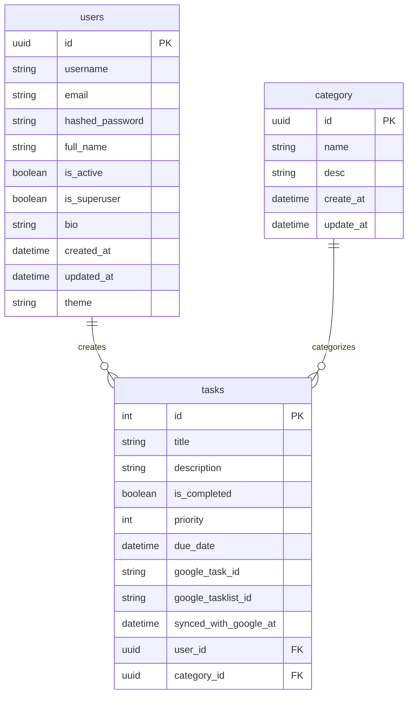

# To-Do Application

Приложение для управления задачами с использованием FastAPI, PostgreSQL и Docker.

## Команда разработчиков

| Имя и фамилия       | GitHub         | Вклад                                                              |
|---------------------|----------------|--------------------------------------------------------------------|
| Иван Шевцов         | @JohnBosska    | Развертывание Docker, настройка БД и Poetry                        |
| Михаил Судовцев     | @Psix10        | Разработка системы авторизации                                     |
| Анна Ротцы          | @AnnaR-PM      | Тестирование                                                       |
| Диана Варава        | @Isabel2312    | Реализация сортировки, фильтрации и пагинации                      |
| Нина Запорожец      | @ninazap       | Тимлид, разработка моделей БД                                      |
| Кирилл Колков       | @kkolkov       | Интеграция с внешним API для хранения задач, темизация             |
| Михаил Марков       | @mishamarkov15 | Реализация CRUD-операций


## Результат реализации бекэнда

1. Развернут Docker

2. Разработаны модели данных для реализации основных функций проекта и для работы сервиса регистрации, авторизации и аутентификации.

3. Разработан API для регистрации, авторизации и аутентификации. Эндпойнты:
- регистрация;
- аутентификация; 
- смена пароля;
- обновление токена.

4. Разработан API для работы основных функций:
- создание, удаление, изменение и получение задач;
- изменение статуса;
- пагинация;
- фильтры по статусам и категориям задач.

5. Разработано подключение к внешнему API для хранения задач.

6. Разработана поддержка тёмной и светлой тем.

7. Реализовано тестирование API-endpoints.

## ER-диаграмма



## Быстрый старт

### 1. Клонирование репозитория

```bash
git clone https://github.com/ninazap/to_do_app.git
cd to_do_app
```

### 2. Запуск с Docker Compose

```bash
docker-compose up --build
```

Это команда:
- Соберет образы для приложения и базы данных
- Запустит PostgreSQL контейнер
- Запустит Python контейнер с приложением
- Настроит сеть между контейнерами

### 3. Доступ к приложению

- API: http://localhost:8000
- Документация API: http://localhost:8000/docs

### 4. Подключение к базе данных

Для подключения к PostgreSQL извне контейнера:

```bash
# Хост: localhost
# Порт: 5432 (или значение из .env)
# Пользователь: todo_user (или значение из .env)
# Пароль: todo_password (или значение из .env)
# База данных: todo_db (или значение из .env)
```
### 5. Проведение миграций

```bash
# Создание миграции
docker-compose exec app poetry run alembic revision --autogenerate -m "description"

# Применение миграций
docker-compose exec app poetry run alembic upgrade head
```

### 6. Запуск тестов

```bash
docker-compose exec app poetry run pytest
```


## Структура проекта

```
to_do_app-1/
├── app/
│   ├── api/          # API endpoints
│   ├── core/         # Конфигурация и подключение к БД
│   ├── crud/         # CRUD операции
│   ├── models/       # SQLAlchemy модели
│   ├── schemas/      # Pydantic схемы
│   ├── services/     # Службы
│   └── main.py       # Точка входа приложения
├── tests/            # Тесты
├── alembic/          # Миграции
├── docker-compose.yml
├── Dockerfile
├── pyproject.toml    # Конфигурация Poetry
└── README.md
```

## Переменные окружения

Все переменные окружения имеют значения по умолчанию и могут быть переопределены через файл `.env` или переменные окружения системы.

- `POSTGRES_USER` - пользователь PostgreSQL (по умолчанию: `todo_user`)
- `POSTGRES_PASSWORD` - пароль PostgreSQL (по умолчанию: `todo_password`)
- `POSTGRES_DB` - имя базы данных (по умолчанию: `todo_db`)
- `POSTGRES_PORT` - порт PostgreSQL (по умолчанию: `5432`)
- `APP_PORT` - порт приложения (по умолчанию: `8000`)

